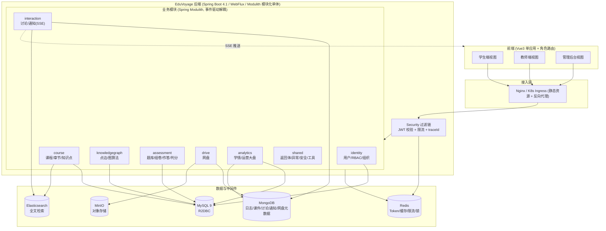
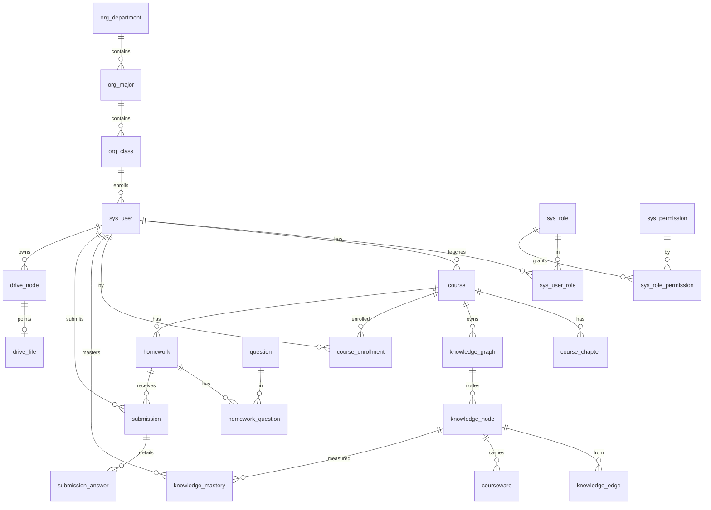

# EduVoyage 第一阶段交付：架构与数据设计

> 状态：第一阶段（架构与数据设计）。本阶段**不含任何业务代码**。
> 基准：已解压并核对仓库根目录的 `backend.zip` 模板，本设计严格对齐模板的包结构、命名与技术栈。

---

## 0. 模板核对结论（重要：模板与文字规格存在冲突，按"模板优先"处理）

我已解压 `backend.zip` 并逐文件核对。模板与任务说明书（"二、技术栈"）存在多处冲突。按你的硬性要求"基于模板扩展、不要另建体系"，以下一律**以模板为准**，并在此显式标注，便于你逐条否决：

| 维度 | 文字规格要求 | **模板实际（采纳）** | 说明 |
|---|---|---|---|
| 构建工具 | （隐含 Maven，提 mvn）| **Gradle (Groovy DSL)**，wrapper 9.5.1 | 全程用 `./gradlew` |
| JDK | Java 21 | **Java 25** toolchain | `build.gradle` 锁定 25 |
| Spring Boot | 3.3.x | **4.1.0** | 连带 Spring Cloud 2025.1.2 |
| 架构形态 | 普通分层 WebFlux | **Spring Modulith 模块化单体**（`spring-modulith-starter-core`）+ 预留 `cloud-gateway-reactive` | 见 §3 |
| 检索引擎 | 未提及 | **Elasticsearch 9.3.3**（模板已带 starter）| 用于课程/课件/讨论全文检索，属规格增强 |
| 包基名 | 未指定 | **`cn.edu.shmtu.eduvoyage`**（group `cn.edu.shmtu`）| 上海海事大学命名风格 |
| 配置文件 | application.yml | 模板是 `application.properties` | 我将转为 `application.yml` + 多 profile（保留兼容）|

模板**尚未包含、需在第二阶段新增**的依赖（规格要求但模板没有）：
- Spring Security Reactive + JWT（jjwt 或 nimbus）
- MinIO / S3 客户端（`io.minio:minio` 异步，或 AWS SDK v2 异步 S3）
- SpringDoc OpenAPI（`springdoc-openapi-starter-webflux-ui`）
- Actuator + Micrometer Prometheus（`spring-boot-starter-actuator`、`micrometer-registry-prometheus`）
- Bean Validation（`spring-boot-starter-validation`）
- 数据库迁移：R2DBC 不直接支持 Flyway，方案见 §6.4

> ⚠️ **需你确认的冲突点**：JDK 25 / Spring Boot 4.1 / Gradle / Modulith / Elasticsearch 这五项是否照模板执行？若你希望回退到规格里的 Java 21 + Boot 3.3 + Maven，请明确，我会以此为准重做选型。其余设计在两种选择下基本不变。

---

## 1. 技术选型说明（最终采纳清单）

### 后端
| 关注点 | 选型 | 理由 |
|---|---|---|
| 语言/框架 | Java 25 + Spring Boot 4.1 + WebFlux | 模板锁定；全链路 Reactor（Mono/Flux）非阻塞 |
| 模块化 | Spring Modulith | 单体内按业务域强边界拆模块，事件驱动解耦，未来可拆微服务 |
| 关系库 | MySQL 9 + R2DBC（`io.asyncer:r2dbc-mysql`）| 强一致结构化数据（用户/课程/图谱点边/作业/成绩）|
| 缓存/会话 | Redis Reactive (Lettuce) | Token、限流、验证码、在线态、排行榜、分布式锁 |
| 文档库 | MongoDB Reactive | 学习日志、课件正文、讨论、通知、网盘元数据、审计 |
| 检索 | Elasticsearch 8/9 Reactive | 课程/课件/讨论全文搜索（模板已带，作为增强）|
| 对象存储 | MinIO (S3 兼容) | 网盘/课件二进制；分片、断点续传、预签名 URL |
| 鉴权 | Spring Security Reactive + JWT 双 Token | Access 15min / Refresh 7d（存 Redis 可吊销）；RBAC + 路由级&方法级 |
| 实时推送 | **SSE（推荐）** | 见 §7 决策 |
| API 文档 | SpringDoc OpenAPI 3 | 按模块/角色分组 |
| 可观测 | Actuator + Micrometer + Prometheus | 结构化日志带 traceId |
| 测试 | JUnit 5 + Reactor `StepVerifier` + Testcontainers | 集成测试拉起 MySQL/Redis/Mongo/MinIO/ES |

### 前端
| 关注点 | 选型 |
|---|---|
| 框架 | Vue 3 (`<script setup>` + Composition API) + Vite + TS |
| 样式 | TailwindCSS（响应式 + 暗色模式）|
| 状态 | Pinia，按模块拆 store |
| HTTP | Axios 单例 + 拦截器（注入 Token / 401 刷新重放 / 统一 toast / loading）|
| 路由 | Vue Router + 角色守卫 + 基于权限码的动态菜单 |
| 图表 | ECharts（通用）+ AntV G6（知识图谱）|
| 三端形态 | **单应用 + 角色路由 + 布局复用（推荐）** 见 §8 |

---

## 2. 实时通信决策：SSE vs WebSocket → **采用 SSE**

| 维度 | SSE | WebSocket |
|---|---|---|
| 方向 | 服务端→客户端单向 | 全双工 |
| 协议 | 纯 HTTP/HTTP2，自动重连(`Last-Event-ID`)| 独立握手协议 |
| 与 WebFlux 契合 | `Flux<ServerSentEvent>` 原生返回，极简 | 需 `WebSocketHandler` 手工管理会话 |
| 鉴权 | 复用现有 JWT 过滤链 | 握手处需另做 Token 校验 |
| 基础设施穿透 | 同普通 HTTP，Nginx/Ingress 友好 | 需额外 `Upgrade` 配置 |

**结论**：本平台的实时需求（新通知、未读计数、讨论新帖、作业提醒）**本质是服务端单向推送**，客户端动作走普通 REST 即可。SSE 与 WebFlux/JWT/Ingress 的契合度更高、实现与运维成本更低。故选 **SSE**。仅当未来出现"实时协同编辑图谱""在线聊天室"等强双向场景，再为该子域单独引入 WebSocket。

---

## 3. 整体架构图



**模块间依赖原则**：仅依赖 `shared`，跨模块通过 Spring Modulith **应用事件**（如 `SubmissionGradedEvent` → `analytics`/`knowledgegraph` 更新掌握度）通信，禁止跨模块直接调用对方内部 service/repository。

---

## 4. 后端目录结构（对齐模板包名 `cn.edu.shmtu.eduvoyage`）

```
eduvoyage/                                  # 模板根（Gradle）
├── build.gradle  settings.gradle  gradlew  compose.yaml
├── src/main/resources/
│   ├── application.yml                     # 由 .properties 转换，含 dev/prod profile
│   ├── application-dev.yml  application-prod.yml
│   ├── db/schema.sql  db/data.sql          # R2DBC 初始化脚本（见 §6.4）
│   └── logback-spring.xml                  # 结构化日志 + traceId
└── src/main/java/cn/edu/shmtu/eduvoyage/
    ├── EduvoyageApplication.java           # 模板已有
    ├── shared/                             # 公共域（被所有模块依赖）
    │   ├── api/      Result, PageResult, ResultCode
    │   ├── exception/ BizException, BizErrorCode(枚举), GlobalErrorWebExceptionHandler
    │   ├── security/ JwtProperties, JwtService, ReactiveSecurityConfig,
    │   │            JwtAuthenticationWebFilter, CurrentUser(参数解析)
    │   ├── ratelimit/ RedisRateLimiter, @RateLimit
    │   ├── config/   R2dbcConfig, MongoConfig, RedisConfig, ElasticsearchConfig,
    │   │            MinioConfig, OpenApiConfig, WebFluxConfig, CorsConfig
    │   ├── storage/  MinioStorageService (分片/预签名/断点续传)
    │   ├── audit/    AuditingConfig (created_by/at, updated_at 自动填充)
    │   └── util/     IdGenerator(雪花), TraceIdFilter
    │
    ├── identity/                           # 模块: 用户/RBAC/组织
    │   ├── api/      事件与对外只读接口(供其他模块)
    │   ├── web/      AuthHandler, UserHandler, OrgHandler + RouterFunction(或 @RestController)
    │   ├── service/  AuthService, UserService, RoleService, OrgService, CaptchaService
    │   ├── repository/ R2DBC Repository
    │   ├── domain/   实体(entity) SysUser, SysRole...
    │   └── dto/      LoginReq, TokenResp, UserVO...
    ├── course/                             # 课程/章节/知识点/选课
    ├── knowledgegraph/                     # 点边模型 + 图算法(GraphAlgoService)
    ├── assessment/                         # 题库/组卷/作答/判分/错题本
    ├── drive/                              # 网盘(MinIO + Mongo 元数据)
    ├── interaction/                        # 讨论/公告/通知(SSE)/站内信
    └── analytics/                          # 学情/教学分析/运营大盘
        # 每个模块内部统一分层: web → service → repository, domain/dto 分离
└── src/test/java/...                       # 单测 + Testcontainers 集成测试
```

> 分层铁律：`web(handler/controller) → service → repository`；**DTO 与 Entity 严格分离**，实体绝不出入参；所有入参 Bean Validation；所有 SQL 参数化。

---

## 5. 前端目录结构（单应用 + 角色路由）

```
frontend/
├── index.html  vite.config.ts  tailwind.config.ts  tsconfig.json
├── src/
│   ├── main.ts  App.vue
│   ├── api/                  # axios 实例 + 拦截器 + 各模块 api 封装
│   │   ├── http.ts           # 单例 + Token 注入 + 401 刷新重放 + toast + loading
│   │   └── modules/ auth.ts user.ts course.ts graph.ts homework.ts drive.ts notify.ts
│   ├── stores/               # Pinia: auth user course knowledgeGraph homework drive notification
│   ├── router/
│   │   ├── index.ts          # 路由 + 全局守卫(登录态/权限码)
│   │   └── routes/ student.ts teacher.ts admin.ts common.ts
│   ├── layouts/              # StudentLayout / TeacherLayout / AdminLayout / BlankLayout
│   ├── components/           # 通用组件: 三态(loading/empty/error)、表格、表单、上传
│   │   ├── graph/ G6Graph.vue (编辑器/浏览器)
│   │   └── charts/ EChart.vue 雷达/热力/折线封装
│   ├── views/
│   │   ├── auth/  student/  teacher/  admin/
│   ├── composables/ useSSE.ts useUpload.ts(分片) usePermission.ts
│   ├── directives/ v-permission
│   ├── types/      接口 DTO 的 TS 类型(与后端对齐)
│   └── styles/     tailwind.css 暗色变量
└── tests/          Vitest 关键组件测试
```

---

## 6. 数据库设计

### 6.1 数据分工总览

| 存储 | 承载数据 |
|---|---|
| **MySQL** | 强结构化、强一致：用户/角色/权限、组织、课程/章节、**知识点节点表 + 边表**、选课、题库/组卷/提交/成绩、掌握度、网盘目录与文件主记录 |
| **MongoDB** | 非结构化、高频写：学习行为日志、课件富文本正文、讨论、通知/站内信、网盘文件版本/扩展元数据、操作审计 |
| **Redis** | Token/会话、缓存、限流计数、验证码、在线态、排行榜、分布式锁 |
| **Elasticsearch** | 课程/课件/讨论全文检索索引 |
| **MinIO** | 文件二进制对象 |

### 6.2 MySQL 完整 DDL

> 约定：所有业务表含审计字段 `created_by, created_at, updated_at, deleted(逻辑删除 0/1)`；主键用 `BIGINT`（雪花 ID，应用层生成）；字符集 `utf8mb4`。外键以**逻辑外键 + 索引**实现（R2DBC/分库友好，约束在应用层与索引层保证），关键关系在注释标注。

```sql
-- ============ 模块: identity 用户 / RBAC / 组织 ============
CREATE TABLE sys_user (
  id            BIGINT       PRIMARY KEY,
  username      VARCHAR(64)  NOT NULL,
  password      VARCHAR(100) NOT NULL,            -- BCrypt
  real_name     VARCHAR(64),
  email         VARCHAR(128),
  phone         VARCHAR(20),
  avatar_url    VARCHAR(512),
  gender        TINYINT      DEFAULT 0,           -- 0未知 1男 2女
  status        TINYINT      NOT NULL DEFAULT 1,  -- 1正常 0禁用 2锁定
  class_id      BIGINT,                           -- 学生归属班级 -> org_class.id
  last_login_at DATETIME,
  created_by    BIGINT,
  created_at    DATETIME     NOT NULL DEFAULT CURRENT_TIMESTAMP,
  updated_at    DATETIME     NOT NULL DEFAULT CURRENT_TIMESTAMP ON UPDATE CURRENT_TIMESTAMP,
  deleted       TINYINT      NOT NULL DEFAULT 0,
  UNIQUE KEY uk_user_username (username),
  UNIQUE KEY uk_user_email (email),
  UNIQUE KEY uk_user_phone (phone),
  KEY idx_user_class (class_id)
) ENGINE=InnoDB DEFAULT CHARSET=utf8mb4 COMMENT='用户';

CREATE TABLE sys_role (
  id          BIGINT      PRIMARY KEY,
  code        VARCHAR(64) NOT NULL,               -- STUDENT/TEACHER/ADMIN
  name        VARCHAR(64) NOT NULL,
  description VARCHAR(255),
  created_by  BIGINT, created_at DATETIME NOT NULL DEFAULT CURRENT_TIMESTAMP,
  updated_at  DATETIME NOT NULL DEFAULT CURRENT_TIMESTAMP ON UPDATE CURRENT_TIMESTAMP,
  deleted     TINYINT NOT NULL DEFAULT 0,
  UNIQUE KEY uk_role_code (code)
) ENGINE=InnoDB DEFAULT CHARSET=utf8mb4 COMMENT='角色';

CREATE TABLE sys_permission (
  id          BIGINT      PRIMARY KEY,
  code        VARCHAR(100) NOT NULL,              -- 权限码 course:create / user:delete
  name        VARCHAR(100) NOT NULL,
  type        TINYINT      NOT NULL DEFAULT 1,    -- 1菜单 2按钮 3接口
  parent_id   BIGINT       DEFAULT 0,
  created_at  DATETIME NOT NULL DEFAULT CURRENT_TIMESTAMP,
  updated_at  DATETIME NOT NULL DEFAULT CURRENT_TIMESTAMP ON UPDATE CURRENT_TIMESTAMP,
  deleted     TINYINT NOT NULL DEFAULT 0,
  UNIQUE KEY uk_perm_code (code)
) ENGINE=InnoDB DEFAULT CHARSET=utf8mb4 COMMENT='权限';

CREATE TABLE sys_user_role (              -- user N:N role
  user_id BIGINT NOT NULL, role_id BIGINT NOT NULL,
  PRIMARY KEY (user_id, role_id), KEY idx_ur_role (role_id)
) ENGINE=InnoDB DEFAULT CHARSET=utf8mb4 COMMENT='用户-角色';

CREATE TABLE sys_role_permission (        -- role N:N permission
  role_id BIGINT NOT NULL, permission_id BIGINT NOT NULL,
  PRIMARY KEY (role_id, permission_id), KEY idx_rp_perm (permission_id)
) ENGINE=InnoDB DEFAULT CHARSET=utf8mb4 COMMENT='角色-权限';

CREATE TABLE org_department (             -- 院系
  id BIGINT PRIMARY KEY, name VARCHAR(128) NOT NULL, code VARCHAR(64),
  created_by BIGINT, created_at DATETIME NOT NULL DEFAULT CURRENT_TIMESTAMP,
  updated_at DATETIME NOT NULL DEFAULT CURRENT_TIMESTAMP ON UPDATE CURRENT_TIMESTAMP,
  deleted TINYINT NOT NULL DEFAULT 0, UNIQUE KEY uk_dept_code (code)
) ENGINE=InnoDB DEFAULT CHARSET=utf8mb4 COMMENT='院系';

CREATE TABLE org_major (                  -- 专业 -> department
  id BIGINT PRIMARY KEY, department_id BIGINT NOT NULL, name VARCHAR(128) NOT NULL,
  code VARCHAR(64), created_by BIGINT, created_at DATETIME NOT NULL DEFAULT CURRENT_TIMESTAMP,
  updated_at DATETIME NOT NULL DEFAULT CURRENT_TIMESTAMP ON UPDATE CURRENT_TIMESTAMP,
  deleted TINYINT NOT NULL DEFAULT 0, KEY idx_major_dept (department_id)
) ENGINE=InnoDB DEFAULT CHARSET=utf8mb4 COMMENT='专业';

CREATE TABLE org_class (                  -- 班级 -> major
  id BIGINT PRIMARY KEY, major_id BIGINT NOT NULL, name VARCHAR(128) NOT NULL,
  grade INT, created_by BIGINT, created_at DATETIME NOT NULL DEFAULT CURRENT_TIMESTAMP,
  updated_at DATETIME NOT NULL DEFAULT CURRENT_TIMESTAMP ON UPDATE CURRENT_TIMESTAMP,
  deleted TINYINT NOT NULL DEFAULT 0, KEY idx_class_major (major_id)
) ENGINE=InnoDB DEFAULT CHARSET=utf8mb4 COMMENT='班级';

-- ============ 模块: course 课程 / 章节 / 知识点 ============
CREATE TABLE course (
  id           BIGINT PRIMARY KEY,
  title        VARCHAR(200) NOT NULL,
  cover_url    VARCHAR(512),
  intro        TEXT,
  credit       DECIMAL(4,1) DEFAULT 0,
  teacher_id   BIGINT NOT NULL,                   -- 课程负责人 -> sys_user.id
  visibility   TINYINT NOT NULL DEFAULT 0,        -- 0公开 1班级限定
  status       TINYINT NOT NULL DEFAULT 0,        -- 0草稿 1已发布 2已归档
  start_date   DATE, end_date DATE,
  created_by BIGINT, created_at DATETIME NOT NULL DEFAULT CURRENT_TIMESTAMP,
  updated_at DATETIME NOT NULL DEFAULT CURRENT_TIMESTAMP ON UPDATE CURRENT_TIMESTAMP,
  deleted TINYINT NOT NULL DEFAULT 0,
  KEY idx_course_teacher (teacher_id), KEY idx_course_status (status)
) ENGINE=InnoDB DEFAULT CHARSET=utf8mb4 COMMENT='课程';

CREATE TABLE course_teacher (             -- 课程可分配多教师
  course_id BIGINT NOT NULL, teacher_id BIGINT NOT NULL, role TINYINT DEFAULT 1,
  PRIMARY KEY (course_id, teacher_id), KEY idx_ct_teacher (teacher_id)
) ENGINE=InnoDB DEFAULT CHARSET=utf8mb4 COMMENT='课程-教师';

CREATE TABLE course_class_scope (         -- 班级限定可见范围
  course_id BIGINT NOT NULL, class_id BIGINT NOT NULL,
  PRIMARY KEY (course_id, class_id)
) ENGINE=InnoDB DEFAULT CHARSET=utf8mb4 COMMENT='课程可见班级';

CREATE TABLE course_chapter (             -- 多级章节(树, parent_id 自关联)
  id          BIGINT PRIMARY KEY,
  course_id   BIGINT NOT NULL,
  parent_id   BIGINT NOT NULL DEFAULT 0,
  title       VARCHAR(200) NOT NULL,
  sort_no     INT NOT NULL DEFAULT 0,
  created_by BIGINT, created_at DATETIME NOT NULL DEFAULT CURRENT_TIMESTAMP,
  updated_at DATETIME NOT NULL DEFAULT CURRENT_TIMESTAMP ON UPDATE CURRENT_TIMESTAMP,
  deleted TINYINT NOT NULL DEFAULT 0,
  KEY idx_chapter_course (course_id), KEY idx_chapter_parent (parent_id)
) ENGINE=InnoDB DEFAULT CHARSET=utf8mb4 COMMENT='章节';

CREATE TABLE knowledge_node (             -- 知识点 = 图节点
  id            BIGINT PRIMARY KEY,
  course_id     BIGINT NOT NULL,
  chapter_id    BIGINT,                           -- 归属章节(可空)
  graph_id      BIGINT NOT NULL,                  -- 一课程可多图
  name          VARCHAR(200) NOT NULL,
  description   TEXT,
  learn_goal    VARCHAR(512),
  est_minutes   INT DEFAULT 0,                    -- 预计时长
  pos_x         DOUBLE, pos_y DOUBLE,             -- G6 画布坐标
  created_by BIGINT, created_at DATETIME NOT NULL DEFAULT CURRENT_TIMESTAMP,
  updated_at DATETIME NOT NULL DEFAULT CURRENT_TIMESTAMP ON UPDATE CURRENT_TIMESTAMP,
  deleted TINYINT NOT NULL DEFAULT 0,
  KEY idx_node_course (course_id), KEY idx_node_graph (graph_id),
  KEY idx_node_chapter (chapter_id)
) ENGINE=InnoDB DEFAULT CHARSET=utf8mb4 COMMENT='知识点节点';

CREATE TABLE knowledge_edge (             -- 知识点关系 = 有向边
  id        BIGINT PRIMARY KEY,
  graph_id  BIGINT NOT NULL,
  from_id   BIGINT NOT NULL,                      -- -> knowledge_node.id
  to_id     BIGINT NOT NULL,
  type      VARCHAR(20) NOT NULL,                 -- PREREQUISITE/SUCCESSOR/CONTAINS/RELATED
  weight    DOUBLE DEFAULT 1,
  created_by BIGINT, created_at DATETIME NOT NULL DEFAULT CURRENT_TIMESTAMP,
  updated_at DATETIME NOT NULL DEFAULT CURRENT_TIMESTAMP ON UPDATE CURRENT_TIMESTAMP,
  deleted TINYINT NOT NULL DEFAULT 0,
  UNIQUE KEY uk_edge (from_id, to_id, type),
  KEY idx_edge_from (from_id, to_id),             -- 复合索引(规格要求)
  KEY idx_edge_graph (graph_id), KEY idx_edge_to (to_id)
) ENGINE=InnoDB DEFAULT CHARSET=utf8mb4 COMMENT='知识点关系边';

CREATE TABLE knowledge_graph (            -- 图元信息 + 版本
  id BIGINT PRIMARY KEY, course_id BIGINT NOT NULL, name VARCHAR(200) NOT NULL,
  version INT NOT NULL DEFAULT 1,
  created_by BIGINT, created_at DATETIME NOT NULL DEFAULT CURRENT_TIMESTAMP,
  updated_at DATETIME NOT NULL DEFAULT CURRENT_TIMESTAMP ON UPDATE CURRENT_TIMESTAMP,
  deleted TINYINT NOT NULL DEFAULT 0, KEY idx_graph_course (course_id)
) ENGINE=InnoDB DEFAULT CHARSET=utf8mb4 COMMENT='知识图谱';

CREATE TABLE courseware (                 -- 课件主记录(正文/二进制在 Mongo/MinIO)
  id           BIGINT PRIMARY KEY,
  node_id      BIGINT NOT NULL,                   -- 挂载知识点
  title        VARCHAR(200) NOT NULL,
  type         TINYINT NOT NULL,                  -- 1视频 2文档 3富文本
  content_ref  VARCHAR(64),                       -- Mongo courseware_content._id(富文本)
  file_id      BIGINT,                            -- drive_file.id(视频/文档)
  duration_sec INT, sort_no INT DEFAULT 0,
  created_by BIGINT, created_at DATETIME NOT NULL DEFAULT CURRENT_TIMESTAMP,
  updated_at DATETIME NOT NULL DEFAULT CURRENT_TIMESTAMP ON UPDATE CURRENT_TIMESTAMP,
  deleted TINYINT NOT NULL DEFAULT 0, KEY idx_cw_node (node_id)
) ENGINE=InnoDB DEFAULT CHARSET=utf8mb4 COMMENT='课件';

CREATE TABLE course_enrollment (          -- 选课
  id BIGINT PRIMARY KEY, course_id BIGINT NOT NULL, student_id BIGINT NOT NULL,
  status TINYINT NOT NULL DEFAULT 1,              -- 1在学 0已退
  progress DECIMAL(5,2) DEFAULT 0,               -- 完成百分比
  enrolled_at DATETIME NOT NULL DEFAULT CURRENT_TIMESTAMP,
  created_by BIGINT, created_at DATETIME NOT NULL DEFAULT CURRENT_TIMESTAMP,
  updated_at DATETIME NOT NULL DEFAULT CURRENT_TIMESTAMP ON UPDATE CURRENT_TIMESTAMP,
  deleted TINYINT NOT NULL DEFAULT 0,
  UNIQUE KEY uk_enroll (course_id, student_id), KEY idx_enroll_student (student_id)
) ENGINE=InnoDB DEFAULT CHARSET=utf8mb4 COMMENT='选课';

CREATE TABLE course_favorite (
  student_id BIGINT NOT NULL, course_id BIGINT NOT NULL,
  created_at DATETIME NOT NULL DEFAULT CURRENT_TIMESTAMP,
  PRIMARY KEY (student_id, course_id)
) ENGINE=InnoDB DEFAULT CHARSET=utf8mb4 COMMENT='课程收藏';

-- ============ 模块: knowledgegraph 掌握度 ============
CREATE TABLE knowledge_mastery (          -- 学生对知识点掌握度(驱动 G6 着色)
  id BIGINT PRIMARY KEY, student_id BIGINT NOT NULL, node_id BIGINT NOT NULL,
  mastery_level TINYINT NOT NULL DEFAULT 0,       -- 0未开始 1学习中 2薄弱 3已掌握
  score DECIMAL(5,2) DEFAULT 0,                    -- 正确率(0-100)
  learn_progress DECIMAL(5,2) DEFAULT 0,
  updated_at DATETIME NOT NULL DEFAULT CURRENT_TIMESTAMP ON UPDATE CURRENT_TIMESTAMP,
  created_at DATETIME NOT NULL DEFAULT CURRENT_TIMESTAMP, deleted TINYINT NOT NULL DEFAULT 0,
  UNIQUE KEY uk_mastery (student_id, node_id), KEY idx_mastery_node (node_id)
) ENGINE=InnoDB DEFAULT CHARSET=utf8mb4 COMMENT='知识点掌握度';

-- ============ 模块: assessment 题库 / 组卷 / 作答 / 成绩 ============
CREATE TABLE question (
  id          BIGINT PRIMARY KEY,
  course_id   BIGINT,
  type        TINYINT NOT NULL,                   -- 1单选2多选3判断4填空5简答6编程
  stem        TEXT NOT NULL,                      -- 题干
  answer      TEXT,                               -- 标准答案(客观题判分用)
  analysis    TEXT,                               -- 解析
  difficulty  TINYINT DEFAULT 1,                  -- 1-5
  node_id     BIGINT,                             -- 关联知识点
  lang        VARCHAR(20),                        -- 编程题语言
  created_by BIGINT, created_at DATETIME NOT NULL DEFAULT CURRENT_TIMESTAMP,
  updated_at DATETIME NOT NULL DEFAULT CURRENT_TIMESTAMP ON UPDATE CURRENT_TIMESTAMP,
  deleted TINYINT NOT NULL DEFAULT 0,
  KEY idx_q_course (course_id), KEY idx_q_node (node_id), KEY idx_q_type (type)
) ENGINE=InnoDB DEFAULT CHARSET=utf8mb4 COMMENT='题目';

CREATE TABLE question_option (            -- 选择题选项
  id BIGINT PRIMARY KEY, question_id BIGINT NOT NULL,
  option_key VARCHAR(8) NOT NULL,                 -- A/B/C/D
  content TEXT NOT NULL, is_correct TINYINT NOT NULL DEFAULT 0, sort_no INT DEFAULT 0,
  KEY idx_opt_q (question_id)
) ENGINE=InnoDB DEFAULT CHARSET=utf8mb4 COMMENT='题目选项';

CREATE TABLE homework (                   -- 作业/试卷
  id          BIGINT PRIMARY KEY,
  course_id   BIGINT NOT NULL,
  title       VARCHAR(200) NOT NULL,
  total_score DECIMAL(6,2) DEFAULT 100,
  time_limit  INT,                                -- 分钟,NULL不限时
  deadline    DATETIME,
  max_attempts INT DEFAULT 1,
  shuffle     TINYINT DEFAULT 0,                  -- 是否乱序
  anti_switch TINYINT DEFAULT 0,                  -- 是否防切屏
  status      TINYINT NOT NULL DEFAULT 0,         -- 0草稿1发布2截止
  created_by BIGINT, created_at DATETIME NOT NULL DEFAULT CURRENT_TIMESTAMP,
  updated_at DATETIME NOT NULL DEFAULT CURRENT_TIMESTAMP ON UPDATE CURRENT_TIMESTAMP,
  deleted TINYINT NOT NULL DEFAULT 0, KEY idx_hw_course (course_id)
) ENGINE=InnoDB DEFAULT CHARSET=utf8mb4 COMMENT='作业/试卷';

CREATE TABLE homework_question (          -- 试卷-题目(含分值/顺序)
  homework_id BIGINT NOT NULL, question_id BIGINT NOT NULL,
  score DECIMAL(5,2) NOT NULL DEFAULT 0, sort_no INT DEFAULT 0,
  PRIMARY KEY (homework_id, question_id), KEY idx_hq_q (question_id)
) ENGINE=InnoDB DEFAULT CHARSET=utf8mb4 COMMENT='试卷-题目';

CREATE TABLE submission (                 -- 一次作答
  id           BIGINT PRIMARY KEY,
  homework_id  BIGINT NOT NULL,
  student_id   BIGINT NOT NULL,
  attempt_no   INT NOT NULL DEFAULT 1,
  status       TINYINT NOT NULL DEFAULT 0,        -- 0进行中1已交2批改中3已完成
  total_score  DECIMAL(6,2),
  submitted_at DATETIME, started_at DATETIME,
  switch_count INT DEFAULT 0,                      -- 切屏次数
  created_by BIGINT, created_at DATETIME NOT NULL DEFAULT CURRENT_TIMESTAMP,
  updated_at DATETIME NOT NULL DEFAULT CURRENT_TIMESTAMP ON UPDATE CURRENT_TIMESTAMP,
  deleted TINYINT NOT NULL DEFAULT 0,
  KEY idx_sub_student_hw (student_id, homework_id),  -- 规格要求复合索引
  KEY idx_sub_hw (homework_id)
) ENGINE=InnoDB DEFAULT CHARSET=utf8mb4 COMMENT='提交记录';

CREATE TABLE submission_answer (          -- 单题作答
  id BIGINT PRIMARY KEY, submission_id BIGINT NOT NULL, question_id BIGINT NOT NULL,
  answer TEXT,                                     -- 学生答案(选项/文本/代码)
  score DECIMAL(5,2),                              -- 该题得分
  is_correct TINYINT,                              -- 客观题对错
  comment VARCHAR(512),                            -- 主观题评语
  KEY idx_sa_sub (submission_id), KEY idx_sa_q (question_id)
) ENGINE=InnoDB DEFAULT CHARSET=utf8mb4 COMMENT='作答明细';

CREATE TABLE wrong_book (                 -- 错题本(自动归集)
  id BIGINT PRIMARY KEY, student_id BIGINT NOT NULL, question_id BIGINT NOT NULL,
  node_id BIGINT, wrong_count INT DEFAULT 1, last_wrong_at DATETIME,
  mastered TINYINT DEFAULT 0,
  created_at DATETIME NOT NULL DEFAULT CURRENT_TIMESTAMP,
  updated_at DATETIME NOT NULL DEFAULT CURRENT_TIMESTAMP ON UPDATE CURRENT_TIMESTAMP,
  UNIQUE KEY uk_wrong (student_id, question_id), KEY idx_wrong_node (node_id)
) ENGINE=InnoDB DEFAULT CHARSET=utf8mb4 COMMENT='错题本';

-- ============ 模块: drive 网盘(目录与文件主记录) ============
CREATE TABLE drive_node (                 -- 目录/文件统一树节点
  id          BIGINT PRIMARY KEY,
  owner_id    BIGINT NOT NULL,
  space_type  TINYINT NOT NULL DEFAULT 1,        -- 1个人 2课程共享
  course_id   BIGINT,                            -- 课程共享空间归属
  parent_id   BIGINT NOT NULL DEFAULT 0,
  name        VARCHAR(255) NOT NULL,
  is_dir      TINYINT NOT NULL DEFAULT 0,
  file_id     BIGINT,                            -- 指向 drive_file(文件时)
  created_by BIGINT, created_at DATETIME NOT NULL DEFAULT CURRENT_TIMESTAMP,
  updated_at DATETIME NOT NULL DEFAULT CURRENT_TIMESTAMP ON UPDATE CURRENT_TIMESTAMP,
  deleted TINYINT NOT NULL DEFAULT 0,            -- 软删=回收站
  KEY idx_drive_owner (owner_id), KEY idx_drive_parent (parent_id),
  KEY idx_drive_course (course_id)
) ENGINE=InnoDB DEFAULT CHARSET=utf8mb4 COMMENT='网盘节点';

CREATE TABLE drive_file (                 -- 物理文件(秒传按 hash 判重)
  id        BIGINT PRIMARY KEY,
  sha256    CHAR(64) NOT NULL,
  size      BIGINT NOT NULL,
  mime      VARCHAR(128),
  bucket    VARCHAR(64) NOT NULL,
  object_key VARCHAR(512) NOT NULL,              -- MinIO 对象键
  ref_count INT NOT NULL DEFAULT 1,              -- 引用计数(秒传共享)
  created_at DATETIME NOT NULL DEFAULT CURRENT_TIMESTAMP,
  UNIQUE KEY uk_file_sha (sha256)
) ENGINE=InnoDB DEFAULT CHARSET=utf8mb4 COMMENT='物理文件';

CREATE TABLE drive_share (                -- 分享链接
  id BIGINT PRIMARY KEY, node_id BIGINT NOT NULL, owner_id BIGINT NOT NULL,
  token VARCHAR(64) NOT NULL, extract_code VARCHAR(16),
  expire_at DATETIME, view_count INT DEFAULT 0,
  created_at DATETIME NOT NULL DEFAULT CURRENT_TIMESTAMP, deleted TINYINT NOT NULL DEFAULT 0,
  UNIQUE KEY uk_share_token (token), KEY idx_share_owner (owner_id)
) ENGINE=InnoDB DEFAULT CHARSET=utf8mb4 COMMENT='文件分享';

CREATE TABLE drive_quota (                -- 配额
  user_id BIGINT PRIMARY KEY, total_bytes BIGINT NOT NULL, used_bytes BIGINT NOT NULL DEFAULT 0,
  updated_at DATETIME NOT NULL DEFAULT CURRENT_TIMESTAMP ON UPDATE CURRENT_TIMESTAMP
) ENGINE=InnoDB DEFAULT CHARSET=utf8mb4 COMMENT='存储配额';
```

> 切屏行为明细、上传分片进度等高频/临时数据放 Redis/Mongo，不入 MySQL。

### 6.3 MongoDB 集合设计

| 集合 | 用途 | 关键字段 | 索引 / 策略 |
|---|---|---|---|
| `learning_log` | 学习行为日志 | `userId, courseId, nodeId, action, durationSec, ts` | `{userId:1, ts:-1}`；**TTL** `ts` 180 天过期 |
| `courseware_content` | 课件富文本正文 | `_id, coursewareId, html, blocks[], version` | `{coursewareId:1}` |
| `discussion` | 讨论帖+回帖 | `_id, courseId, nodeId, authorId, title, content, parentId(回帖), likes[], replyCount, ts` | `{courseId:1, ts:-1}`、`{parentId:1}` |
| `notification` | 通知/站内信 | `_id, toUserId, type, title, body, refId, read(bool), category, ts` | `{toUserId:1, read:1, ts:-1}` |
| `file_meta` | 网盘文件扩展元数据/版本 | `_id, driveFileId, versions[], previewMeta, tags[]` | `{driveFileId:1}` |
| `audit_log` | 操作审计 | `_id, userId, module, action, ip, traceId, detail, ts` | `{userId:1, ts:-1}`；**TTL** 1 年 |
| `upload_session` | 分片上传断点续传状态 | `_id, uploadId, sha256, totalParts, uploadedParts[], expireAt` | **TTL** `expireAt` 24h |

### 6.4 Schema 迁移方案（R2DBC 限制）

R2DBC 不被 Flyway/Liquibase 直接驱动。采纳方案：
- **dev/test**：Spring Boot `spring.sql.init`（`schema.sql` + `data.sql`，R2DBC `ConnectionFactoryInitializer`）自动建表灌种子。
- **prod**：用 **Flyway over JDBC**（单独的 JDBC 连接仅用于迁移，不进响应式链路）在应用启动前执行 DDL；运行期仍走 R2DBC。这样既满足规范化迁移，又不违反"响应式链路禁阻塞"。

### 6.5 跨库关联约定

MongoDB 文档统一通过**业务 ID 字段**（`userId/courseId/nodeId/coursewareId/driveFileId`）软关联 MySQL 主键；不做跨库事务，靠 **Spring Modulith 应用事件 + 最终一致**协调（如判分完成事件 → 更新 `knowledge_mastery`(MySQL) 与写 `learning_log`(Mongo)）。ES 索引由 course/discussion 模块在写入后异步同步。

### 6.6 总体 ER（核心实体）



---

## 7. 知识图谱图算法（应用层，基于点表+边表）—— Phase 3 实现预告

`GraphAlgoService`（纯内存计算，从 R2DBC 拉点边后在 Reactor 链上算）：
- **前置链路回溯**：从节点反向沿 `PREREQUISITE` 边 BFS/DFS。
- **成环检测**：新增 `PREREQUISITE` 边前做 DFS 判环，成环则抛 `BizException(GRAPH_CYCLE)` 拒绝（验收点）。
- **学习路径推荐**：Kahn 拓扑排序 + 薄弱点（`knowledge_mastery.mastery_level<=2`）优先。
- **两点路径**：BFS 最短路。
- 性能：500 节点规模在应用层用邻接表 O(V+E) 计算，满足验收。

---

## 8. 三端形态推荐：**单应用 + 角色路由 + 布局复用（强烈推荐）**

| 方案 | 优点 | 缺点 |
|---|---|---|
| **A. 单应用 + 角色路由（推荐）** | 登录态/Axios/UI 组件/类型/G6&ECharts 封装全复用；一次构建一次部署；维护成本低 | 单包体积略大（可路由级懒加载 + 按角色分 chunk 缓解）|
| B. 三个独立应用 | 物理隔离、独立发布 | 三套登录/拦截器/组件重复；共享代码需 monorepo 抽包，复杂度高；权限码模型重复实现 |

**推荐 A**，并落地：
1. 一套登录，登录后由后端返回**权限码集合 + 角色**；
2. `router/routes/{student,teacher,admin}.ts` 三组路由 + 对应 `layouts/`，全局守卫按角色与权限码动态挂载菜单；
3. 路由级懒加载 + 按角色 `manualChunks` 分包，避免学生端加载管理后台代码；
4. 组件、store、api、类型在三端间复用。

---

## 9. 默认账号（初始化数据，Phase 2 灌入）

| 角色 | 用户名 | 密码(BCrypt 存储) |
|---|---|---|
| 管理员 | `admin` | `Admin@123` |
| 教师 | `teacher` | `Teacher@123` |
| 学生 | `student` | `Student@123` |

---

## 第一阶段结束

以上为架构与数据设计完整产物。**等待你的确认**，特别是 §0 的五个模板冲突点（Java 25 / Boot 4.1 / Gradle / Modulith / Elasticsearch）是否照模板执行。确认后，我将基于模板进入**第二阶段：后端基础设施**。
